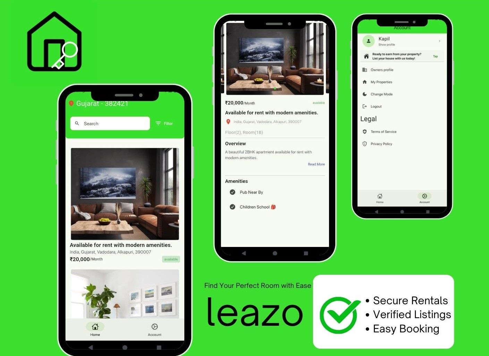

# Leazo - Room Service App

Leazo is a mobile application designed to simplify the room rental process. It allows users to find and rent rooms with ease, offering features like image picking, authentication, user state management, and a seamless user experience. The app is built using Flutter, Riverpod for state management, and MongoDB for data storage.

## Features

- **Room Listings:** View available rooms with detailed descriptions, images, and rental information.
- **Image Picking:** Easy-to-use functionality for users to upload images of rooms for listings.
- **Authentication:** Secure login and signup processes for both tenants and landlords.
- **User State Management:** User sessions and states are managed using Riverpod for a smooth experience.
- **Error Handling:** Robust error handling ensures that users have a seamless experience, even when something goes wrong.
- **MongoDB Integration:** All room listings, user data, and associated information are stored in a MongoDB database, providing a flexible and scalable data structure.
- **Backend Integration:** The app integrates with a backend server using MongoDB ODM (Object Document Mapping) for smooth database operations.

## Technologies Used

- **Flutter:** Framework used to build the app, providing a native-like experience for iOS and Android.
- **Riverpod:** State management library for Flutter, providing a scalable and flexible way to manage app state.
- **MongoDB:** NoSQL database used for storing room listings, user data, and more.
- **MongoDB ODM (Object Document Mapper):** Used to interact with MongoDB collections and manage data models seamlessly.
- **Firebase:** Documents storage.
- **Dart:** Programming language used for Flutter development.
- **APIs:** Integration with backend RESTful APIs for room listings, user management, and more.
  
 
