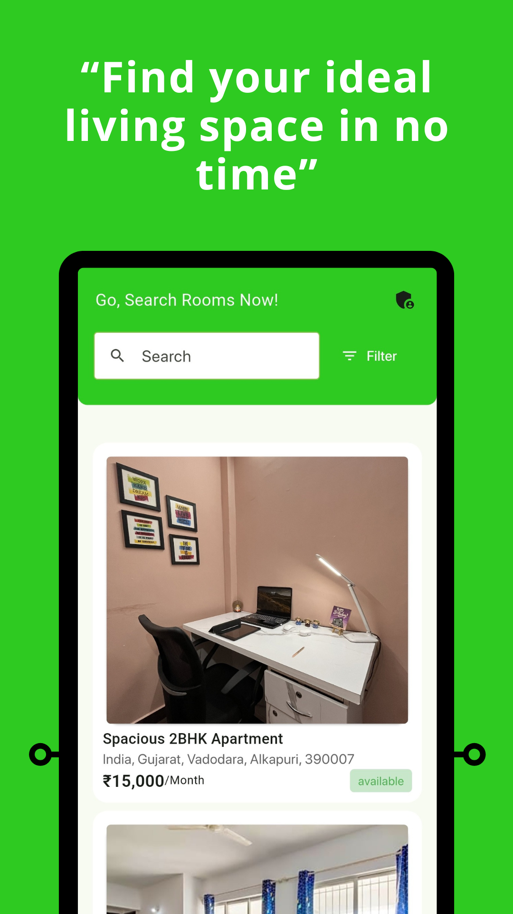
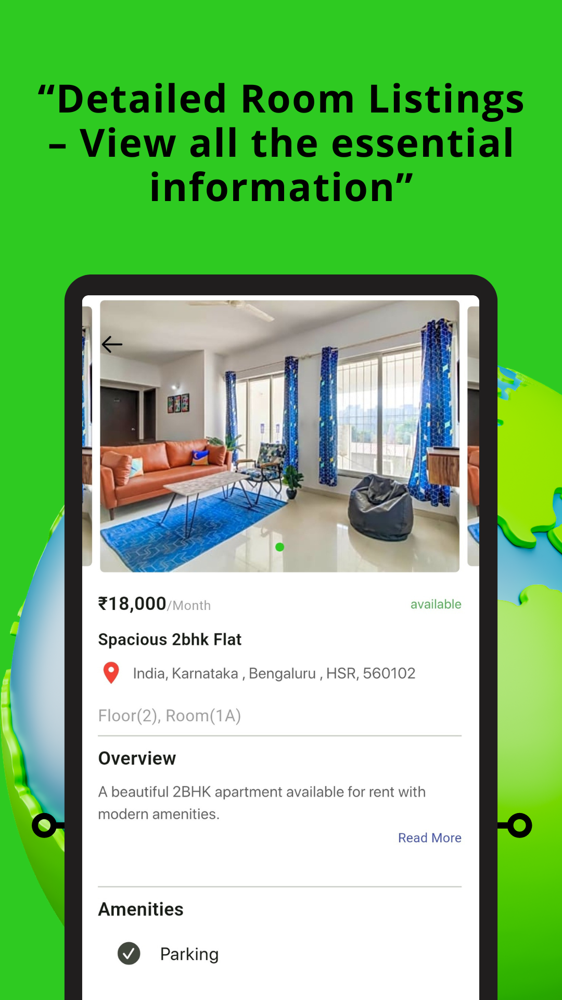
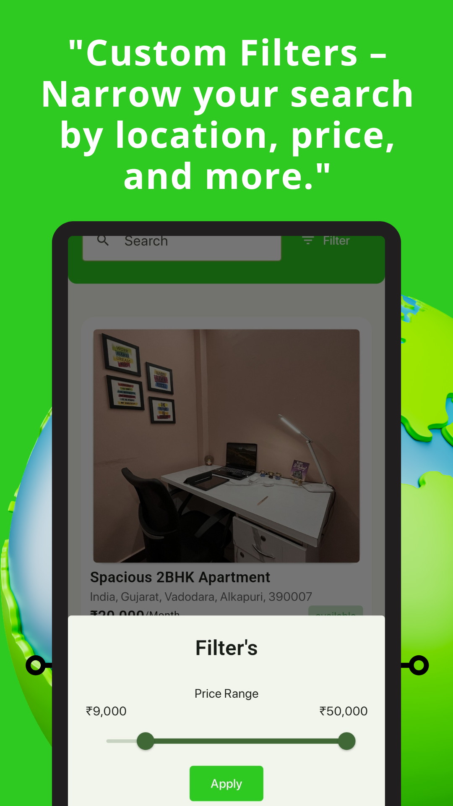
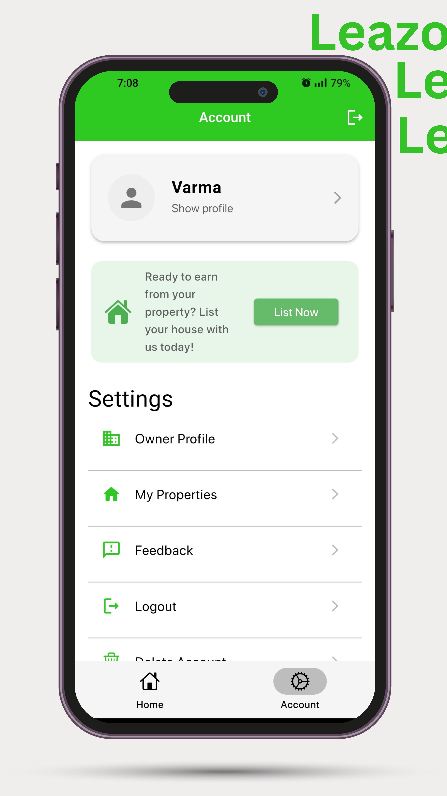
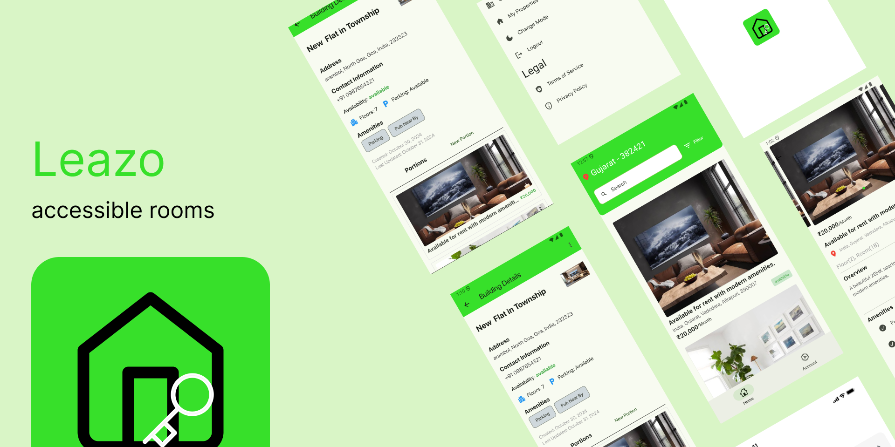

# 🚪 Leazo – Room Search Made Accessible & Simple  

**Leazo** is a cross-platform mobile application that **redefines the way people search, list, and rent rooms**.  
Built for both **tenants and landlords**, it delivers a **fast, reliable, and intuitive experience**, with modern UI and scalable backend architecture.  

---

## ✨ Key Highlights  

- 📍 **Seamless Search** – Find verified rooms with detailed descriptions, pricing, amenities, and images.  
- 📸 **Image Uploads** – Landlords can upload property images effortlessly for attractive listings.  
- 🔐 **Secure Authentication** – Role-based login & signup for tenants and landlords.  
- ⚡ **Smooth State Management** – Riverpod ensures app-wide consistency with minimal performance overhead.  
- 🛡 **Error Resilience** – Graceful fallback screens and error handlers for uninterrupted usage.  
- 🗄 **Scalable Storage** – MongoDB with ODM for structured, query-optimized data access.  
- ☁ **Cloud Integration** – Firebase for document storage and secure image handling.  
- 🔗 **Robust APIs** – Backend built with clean architecture and RESTful API design for scalability.  

---

## 🛠 Tech Stack  

| Layer              | Technologies |
|--------------------|--------------|
| **Frontend**       | Flutter, Dart |
| **State Mgmt**     | Riverpod |
| **Backend**        | Node.js, Express.js |
| **Database**       | MongoDB + ODM |
| **Cloud Storage**  | Firebase |
| **APIs**           | RESTful APIs |
| **Version Control**| Git & GitHub |

---

## 📱 Screenshots  

  
  
  
  
  
  

---

## 🚀 Architecture Overview  

This ensures:  
- **High Performance** – Optimized queries & async operations.  
- **Scalability** – Modular architecture for future feature expansion.  
- **Reliability** – Error handling & retry mechanisms for API calls.  

---

## 📌 Impact & Future Scope  

- **Target Audience:** Students, working professionals, landlords.  
- **Goal:** Reduce room search time by **70%** through better search filters and real-time listings.  
- **Upcoming Features:**  
  - Advanced location-based search  
  - Chat between landlords and tenants  
  - AI-based rent predictions  

---

  

---
📧 **Contact:** [udaykiran9147@gmail.com](mailto:udaykiran9147@gmail.com) | 🌐 **Portfolio:** [GitHub](https://github.com/Uday-kiran9147) | 🐦 [Twitter](https://twitter.com/uday_krn)

